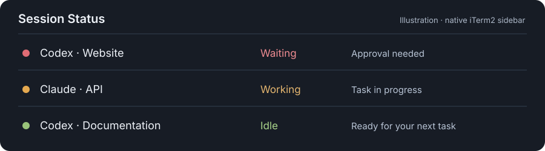

# Codex iTerm2 Status

See which Codex sessions are working, waiting for you, or idle in iTerm2's native
**Session Status** sidebar. Codex and Claude Code can appear in the same list;
click a row to jump to its terminal. Optional profiles launch new Codex agents.



This is an independent community integration for **Codex CLI in iTerm2**.
iTerm2 supplies the sidebar; this plugin supplies observational lifecycle hooks
and a launcher installer. Claude Code is optional. No daemon, API key, pip package,
or MCP server is needed by this plugin.

**Public beta: [v0.2.0-beta.1](https://github.com/treyreynolds/iterm2-status/releases/tag/v0.2.0-beta.1).** See the
[compatibility matrix](docs/compatibility.md) for verified setups and current limits.

## Requirements

- macOS with **iTerm2 3.7+**. iTerm2 3.7 requires macOS 13 or later.
- **Codex CLI 0.153.4+**, installed and available to your shell.
- **Python 3.9+**, from Homebrew, python.org, pyenv, or your existing developer tools.
- Enable **iTerm2 → Settings → General → Magic → Python API**.

The installer checks the actual Codex and iTerm capabilities before changing
configuration. It remembers the Python interpreter used for installation, so hooks
also work when Codex has a minimal `PATH`. Your Codex login and hook trust remain
under Codex's normal controls.

## Install

Clone the repository:

```sh
mkdir -p ~/plugins
git clone https://github.com/treyreynolds/iterm2-status.git ~/plugins/iterm2-status
cd ~/plugins/iterm2-status
python3 install.py
python3 install.py doctor --live
```

Or extract a release ZIP to `~/plugins/iterm2-status` and run the same Python
commands from that folder. Another source directory is fine: the installer creates
`~/plugins/iterm2-status` as a symlink if that location is free.

Then:

1. In iTerm2, choose **View → Toggle Toolbelt**, then **View → Toolbelt → Session Status**.
2. Start a **new Codex session**. Open **`/hooks`** and review/trust this plugin's hooks.
3. Run a short task. Its row should move from idle to working and return to idle.
4. Double-click the **Codex** profile to open additional agents in the current directory.

The installer creates a personal Codex marketplace entry and a separate dynamic
profile file. It preserves unrelated plugins and profiles and backs up changed
configuration. Preview the installation with `python3 install.py --dry-run`.

### Customize launchers and locations

Add a launcher for a fixed workspace and inherit an existing iTerm appearance:

```sh
python3 install.py --workspace ~/work --workspace-name 'Codex — Work' \
  --parent-profile 'Default'
```

Custom application, CLI, or shell paths:

```sh
python3 install.py --iterm-app "$HOME/Applications/iTerm.app" \
  --codex /opt/homebrew/bin/codex --shell /bin/zsh
```

The installer supports bash, zsh, and fish login shells. Paths containing spaces,
quotes, and Unicode are accepted. Saved choices are reused on upgrades;
`--no-workspace` removes the optional workspace launcher.

The installer respects `CODEX_HOME` for Codex configuration backups and
`XDG_CONFIG_HOME` for this integration's settings. Keep those environment settings
consistent when installing and launching Codex. Advanced runtime overrides and
application discovery are documented in [troubleshooting](docs/troubleshooting.md).

## Upgrade and rollback

From a clone on `main`:

```sh
cd ~/plugins/iterm2-status
git pull --ff-only
python3 install.py
python3 install.py doctor --live
```

Start a fresh Codex session and review any changed hooks. Pulling source alone
cannot update Codex's installed cache. iTerm2 and Codex updates also do not fetch
plugin updates; update each component separately.

For ZIP installations, extract the new release into the source directory and rerun
the installer. To roll back a clean Git checkout, use
`git switch --detach <release-tag>`, then `python3 install.py`. Return with
`git switch main` before the next branch upgrade. Commit or stash your own edits
before switching versions.

## Troubleshoot or remove

```sh
python3 install.py doctor
python3 install.py doctor --live
python3 install.py doctor --json
python3 install.py uninstall --dry-run
python3 install.py uninstall
```

`doctor` checks dependency versions/capabilities, installed plugin version,
interpreter, source link, and the actual launcher entries. `--live` also checks the
iTerm connection and may trigger iTerm's access prompt. It does not change a
session's status. Hook trust must be checked separately with `/hooks`.

`doctor --json` produces a small support report containing versions and named check
results, without home paths, project names, terminal IDs, prompts, or tool output.
Use it when [reporting a bug](https://github.com/treyreynolds/iterm2-status/issues/new/choose).
See [troubleshooting](docs/troubleshooting.md) for specific fixes.

Uninstall removes the cached Codex plugin and archives only its own launcher
profiles. Source, preferences, marketplace entry, and backups remain available for
reinstallation. Repeating uninstall is safe.

## Data and behavior

The hooks report status to an explicit iTerm session UUID. They always return an
empty JSON object successfully, including when iTerm is unavailable. They never
approve or block agent actions, read transcripts, or add model context.

The local cache contains session IDs, project folder basenames, state, timestamps,
background-agent IDs, and hashes of tool identity. Prompts, raw command arguments,
and tool responses are not stored. No telemetry is sent. iTerm displays project
basenames and generic labels such as “Approval needed.” See [privacy and security](SECURITY.md).

| Content | Default location |
|---|---|
| Source | `~/plugins/iterm2-status/` |
| Personal marketplace | `~/.agents/plugins/marketplace.json` |
| Installed hooks | Codex's versioned plugin cache |
| Preferences and selected interpreter | `~/.config/codex-iterm2-status/` |
| Configuration backups | `~/.config/codex-iterm2-status/backups/` |
| Launcher profiles | `~/Library/Application Support/iTerm2/DynamicProfiles/codex-profiles.json` |
| Status cache | Codex's `PLUGIN_DATA` directory; fallback `~/.cache/codex-iterm2-status/` |

## Contribute

Run `make test`. The runtime and tests use Python's standard library. Source
validation, version updates, and reproducible ZIP/checksum packaging are included
in this repository. See [CONTRIBUTING.md](CONTRIBUTING.md) and the
[release procedure](docs/releasing.md).

Licensed under the [MIT License](LICENSE).

## References

- [Official OpenAI documentation: Codex hooks](https://learn.chatgpt.com/docs/hooks)
- [iTerm2 Session Status](https://iterm2.com/documentation-session-status.html)
- [iTerm2 utilities](https://iterm2.com/documentation-utilities.html)
- [iTerm2 dynamic profiles](https://iterm2.com/documentation-dynamic-profiles.html)
